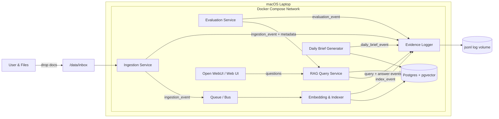

# 📐 Architecture & Data Flow – Local AI Factory (architecture.md)

### Purpose

Design the end‑to‑end architecture for the Local AI Factory: a laptop‑local, Docker‑orchestrated RAG system that ingests files from a watched folder, builds a knowledge base, answers questions, and produces verifiable audit evidence of its own work.

### High‑Level Components

- **Ingestion Service**
    - Watches `/data/inbox` for new or changed files.
    - Normalizes to UTF‑8 text (PDF, DOCX, MD, TXT, HTML).
    - Emits `ingestion_event` records to a queue.
- **Embedding & Indexer Service**
    - Subscribes to `ingestion_event`.
    - Chunks documents, calls local LLM embedding endpoint, writes vectors to pgvector / Qdrant.
    - Maintains document + chunk metadata (source path, hash, timestamps, tags).
- **RAG Query Service**
    - HTTP API for question answering (`POST /rag/query`).
    - Orchestrates retrieval → ranking → answer generation using local LLM.
    - Returns answer, cited chunks, and internal reasoning metadata.
- **Daily Brief Generator**
    - Scheduled worker (e.g., cron inside container).
    - Runs once per day over recent changes and recent questions.
    - Produces a “Daily Executive Brief” markdown file in `/data/briefs` and a JSON record in the evidence log.
- **Self‑Test & Evaluation Service**
    - Runs predefined test suites (prompted Q&A, edge cases, hallucination traps).
    - Scores answers and logs evaluation artifacts.
- **Evidence Logger**
    - Single, append‑only JSONL log sink.
    - Receives structured events from all services via HTTP or a local queue.
    - Maintains hash chain across records.
- **Web UI / Open WebUI**
    - Browser front‑end for interactive chat + admin views.
    - Surfaces: search, chat, daily briefs, evaluation results, evidence log explorer.
- **Storage**
    - Postgres + pgvector (or Qdrant) for documents, chunks, and queries.
    - Local volume mounts for raw documents, briefs, and logs.

### Data Flows (End‑to‑End)

### 1. Ingestion Path

1. User drops files into `/data/inbox` on the host.
2. Docker bind mount exposes this as `/app/inbox` inside the Ingestion Service.
3. Ingestion Service detects changes (polling or inotify‑style watcher).
4. For each file:
    - Extract text + metadata.
    - Compute SHA‑256 hash of raw bytes.
    - Emit `ingestion_event` to queue and Evidence Logger.
5. Evidence Logger writes a JSONL record with:
    - `event_type = "ingestion"`
    - file path, size, MIME type, hash, timestamps
    - `prev_hash` + `record_hash`.

### 2. Indexing Path

1. Indexer Service reads `ingestion_event`.
2. Loads normalized text.
3. Chunks text using configurable rules (by tokens, headings, etc.).
4. Calls local embedding endpoint (Ollama or equivalent).
5. Writes:
    - One row per document in `documents` table.
    - One row per chunk in `chunks` table with embedding vector.
6. Emits `index_event` and logs to Evidence Logger.

### 3. RAG Query Path

1. UI or API client calls `POST /rag/query` with:
    - `question`
    - optional filters (tags, date ranges, document ids).
2. RAG Service:
    - Embeds the question.
    - Runs vector similarity search over `chunks`.
    - Applies ranking / filtering and assembles context.
    - Calls local LLM completion endpoint with system + user prompts.
    - Produces structured response: answer, citations, internal metadata.
3. RAG Service emits `query_event` and `answer_event` to Evidence Logger.
4. Evidence Logger writes both events with hash chaining.

### 4. Daily Executive Brief Path

1. Scheduler container triggers Daily Brief Generator once per day.
2. Brief Generator pulls from:
    - `queries` and `answers` over last 24 hours.
    - Recently changed `documents` / `chunks`.
3. Brief Generator prompts local LLM to synthesize:
    - Key changes in knowledge base.
    - Top themes from user questions.
    - Actionable recommendations.
4. Writes:
    - `YYYY‑MM‑DD_daily_brief.md` into `/data/briefs`.
    - `daily_brief_event` into Evidence Logger.

### 5. Evaluation & Self‑Testing Path

1. Evaluation Service runs test suites on demand or nightly:
    - Fixed prompts with expected patterns.
    - Hallucination traps with no supporting evidence.
    - Regression tests against previous answers.
2. For each test case:
    - Calls RAG API.
    - Grades output using either rule‑based checks or a local "judge" model.
    - Produces `evaluation_event` with scores and diff vs. prior runs.
3. Evidence Logger appends all evaluation events.

### Mermaid Architecture Diagram

### Key Design Principles

- **Local‑first:** No external API calls in the default path. Optional remote provider support can be added later via an AI Gateway.
- **Evidence‑by‑default:** Every meaningful action emits a structured event to the Evidence Logger.
- **Composable:** Each service is a small container with a single responsibility.
- **Replaceable:** Vector store (pgvector vs Qdrant), LLM model, and UI can be swapped without breaking the evidence model.
- **Deterministic surfaces:** Public APIs have typed, schema‑checked responses suitable for PCI‑ish environments.
- 
